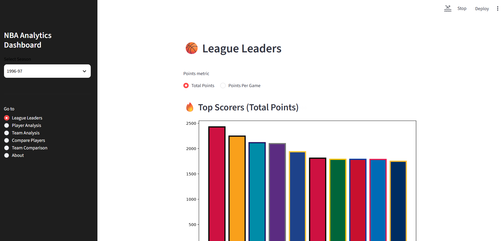

<p align="center">
  
</p>
<h1 align="center">NBA Analytics Dashboard</h1>

# 🏀 NBA Analytics Dashboard
A fully modular, multi‑page NBA analytics platform built with Python, SQLite, and Streamlit.  
This project provides deep statistical insights into players, teams, seasons, and league trends using a clean, professional architecture.

---

## 📌 Overview
This dashboard allows you to explore NBA data across multiple seasons with:

- League leaders (PTS, REB, AST, shooting, fantasy, advanced metrics)
- Player analysis (basic + advanced metrics)
- Team analysis (ORtg, DRtg, Pace, possessions, roster stats)
- Player comparison (multi‑player, multi‑season)
- Team comparison (multi‑team, multi‑season)
- Cross‑season support
- Automatic team color styling
- Reproducible SQLite database pipeline
- Full Fantasy Analytics Center (Leaderboard, Consistency, Boom/Bust, Sleepers, Waiver Wire, Draft Board)
- Shot Chart Visualizations

The project supports **modern NBA Stats API seasons** and **older Basketball Reference seasons**, normalized into a unified schema.

---

## 🏗️ Architecture

### Project Structure

```text
pabs-nba-analytics-dashboard/
│
├── app.py                         # Streamlit entry point (root-level)
│
├── dashboard/
│   ├── __init__.py
│   ├── components/
│   │   ├── __init__.py
│   │   └── styling.py             # Global CSS + table styling
│   │
│   └── pages/                     # Modular Streamlit pages
│       ├── __init__.py
│       ├── league_leaders.py
│       ├── player_analysis.py
│       ├── team_analysis.py
│       ├── compare_players.py
│       ├── team_comparison.py
│       ├── shot_charts.py         
│       ├── fantasy.py             # NEW: Full Fantasy Analytics Center
│       └── about.py
│
├── src/
│   ├── __init__.py
│   ├── db.py                      # SQLite connection + query helper
│   ├── metrics.py                 # TS%, eFG%, AST/TOV, etc.
│   ├── colors.py                  # Team color system
│   ├── utils.py                   # Season helpers + misc utilities
│   ├── team_stats.py              # ORtg, DRtg, Pace, possession logic
│   ├── fantasy/                # NEW: Fantasy analytics engine
│   │   ├── scoring.py
│   │   ├── consistency.py
│   │   ├── boom_bust.py
│   │   ├── sleepers.py
│   │   ├── waiver.py
│   │   └── draft.py
│   └── shot_charts/               # NEW: Shot chart engine
│       ├── __init__.py
│       ├── fetch_data.py          # NEW: Local shot-data loader
│       ├── court.py               # NEW: NBA court rendering
│       ├── plotting.py            # NEW: scatter (make/miss)
│       ├── heatmap.py             # NEW: contour heatmap
│       └── hexbin.py              # NEW: hexbin density
│
├── src/data_pipeline/
│   ├── __init__.py
│   ├── create_database.py         # Build nba.db from raw CSVs
│   ├── data_loader.py             # Load new seasons into database
│   └── normalize_br.py            # Normalize Basketball Reference CSVs
│
├── data/
│   ├── raw/                       # Raw CSVs (nba_api + BR)
│   ├── processed/                 # Cleaned tables (optional)
│   └── shots/                     # NEW: Full shot-chart dataset (2010–11 → 2025–26)
│       ├── 2010-11/
│       │   ├── regular/
│       │   └── playoffs/
│       ├── 2011-12/
│       │   ├── regular/
│       │   └── playoffs/
│       └── ...
│
├── notebooks/                     # Jupyter notebooks for exploration
├── reports/                       # Generated charts + summaries
├── images/                        # Dashboard screenshots
│
├── requirements.txt               # Project dependencies
└── README.md
```

---

## ✨ Features

### Dashboard Pages
- **League Leaders**  
  - Points (Total / Per Game)  
  - Rebounds (Total / Per Game / OREB / DREB)  
  - Assists (Total / Per Game)  
  - Shooting (FG%, 3P%, FGA, FGM)  
  - Fantasy Points  
  - Steals, Blocks, Turnovers, Minutes  
  - Advanced Metrics (TS%, eFG%, AST/TOV)

- **Player Analysis**  
  - Basic stats  
  - Advanced metrics  
  - Team color‑styled tables  
  - Per‑game and efficiency charts

- **Team Analysis**  
  - ORtg, DRtg, Pace, Possessions  
  - Team roster stats  
  - Team color‑styled tables  
  - Team scoring charts

- **Compare Players**  
  - Unlimited players  
  - Cross‑season comparison  
  - Per‑game stats  
  - Shooting & efficiency charts  
  - Advanced metrics

- **Team Comparison**  
  - Unlimited teams  
  - Cross‑season comparison  
  - Team summaries  
  - Comparison table  
  - Grouped bar charts (ORtg, DRtg, Pace, REB, AST, 3PA)

- **Shot Charts**
  - Make/Miss Scatter
    - Green O = make
    - Red X = miss
    - Hover tooltips with full shot metadata
  - Heatmap (Contour)
    - Geographic-style density map
    - Smooth contour gradients
  - Hexbin
    - Fixed-grid hex density
  - Fully local shot data
    - No API calls
    - Instant loading
    - Supports Regular Season + Playoffs
    - Seasons 2010-11 → 2025-26

- **About Page**

---

### ⭐ NEW: Fantasy Analytics Center

- **Fantasy Leaderboard**  
  - Fantasy PPG  
  - Total Fantasy Points  
  - Custom scoring  
  - Team‑colored charts & tables

- **Consistency Analyzer**  
  - CV, Std Dev, Fantasy Stability  
  - Per‑game fantasy chart  
  - Consistency classification

- **Boom/Bust Analyzer**  
  - Boom %, Bust %, Neutral %  
  - Minutes reliability  
  - Boom/Bust bar chart  
  - Game log breakdown

- **Sleepers Engine**  
  - Sleeper Score  
  - Breakout Probability  
  - Trend Score  
  - Boom/Bust integration  
  - Team‑colored sleeper leaderboard

- **Waiver Wire Engine**  
  - Availability Score  
  - Opportunity Score  
  - Waiver Score  
  - Team‑colored waiver leaderboard  
  - Fantasy‑friendly availability model

- **Draft Board (Tier System)**  
  - Draft Score  
  - Tier (S/A/B/C/D)  
  - Risk Rating  
  - Role Projection  
  - Tier‑colored charts  
  - Tier + Risk dual‑border tables  
  - Position filters  
  - Role icons  

---

## 📁 Data Sources

### NBA Stats API (via `nba_api`)
Used for:
- Modern seasons (1996–present)
- Full per‑game stats
- Team game logs (2010–present)

### Basketball Reference (manual CSVs)
Used for:
- Older seasons (pre‑1996)
- Normalized using `normalize_br.py`

### Local Shot Data (`data/shots/`) - NEW
A complete shot-chart dataset covering:
- 2010-11 → 2025-26
- Regular Season + Playoffs
- One CSV per player per season per type:
  `data/shots/{season}/{regular|playoffs}/{player_id}.csv`
Each CSV contains:
- Shot coordinates (`LOC_X`, `LOC_Y`)
- Make/miss flags
- Shot type, zone, distance
- Game metadata
- Player metadata

### Raw Data Files
- `players.csv`
- `teams.csv`
- `rookies.csv`
- `season_stats_*.csv`
- `team_game_stats_*.csv`
- `br_*.csv` (Basketball Reference)

## 📂 Data Folder Structure

The `data/` directory contains all raw and processed data used to build the `nba.db` SQLite database.

```text
data/
│
├── raw/               # Raw CSVs (never edited)
│   ├── season_stats_YYYY-YY.csv
│   ├── team_game_stats_YYYY-YY.csv
│   ├── players.csv
│   ├── rookies.csv
│   ├── teams.csv
│   └── br_YYYY_per_game.csv
│
├── processed/         # Cleaned, normalized, or transformed data
│
└── shots/             # NEW: Full shot-chart dataset
    ├── 2010-11/
    │   ├── regular/
    │   └── playoffs/
    ├── 2011-12/
    │   ├── regular/
    │   └── playoffs/
    └── ...
```

### Raw Data (`data/raw/`)
This folder contains **all original CSVs**, including:

- **NBA Stats API seasons**  
  `season_stats_1988-89.csv` → `season_stats_2025-26.csv`

- **Team game logs (2010–present)**  
  `team_game_stats_2010-11.csv` → `team_game_stats_2025-26.csv`

- **Basketball Reference per-game data**  
  `br_1995_per_game.csv`

- **Static tables**  
  - `players.csv`
  - `rookies.csv`
  - `teams.csv`

These files are intentionally kept **raw and untouched** so the database can be rebuilt at any time.

### Processed Data (`data/processed/`)
This folder is currently empty, but reserved for:

- normalized BR tables  
- merged datasets  
- intermediate transformations  
- cleaned versions of raw files  
- exports for notebooks or reports  

The dashboard does **not** read from `processed/`.  
It is optional and used only for development or analysis.

### Database Pipeline
The raw CSVs are loaded into SQLite using:

python src/data_pipeline/create_database.py
python src/data_pipeline/data_loader.py
python src/data_pipeline/normalize_br.py

This pipeline ensures:

- reproducibility  
- consistent schema  
- safe reloading  
- support for both modern and historical seasons  

---

## 🚀 Running the Dashboard

### 1. Clone the repository
`git clone https://github.com/pabs-nba-analytics-dashboard.git` (github.com in Bing)
`cd pabs-nba-analytics-dashboard`

### 2. Create virtual environment
`python -m venv .venv`
`source .venv/bin/activate`   # Mac/Linux
`.venv\Scripts\activate`      # Windows

### 3. Install dependencies
`pip install -r requirements.txt`

### 4. Run the dashboard
`streamlit run app.py`

---

## 🛠️ Data Pipeline

### Build the database from scratch
`python src/data_pipeline/create_database.py`

### Load new seasons
Place new CSVs into `data/raw/`:

- `season_stats_YYYY-YY.csv`
- `team_game_stats_YYYY-YY.csv`

Then run:

`python src/data_pipeline/data_loader.py`

### Normalize Basketball Reference CSVs
`python src/data_pipeline/normalize_br.py`

This converts BR data into the NBA Stats API schema.

---

## 🛣️ Roadmap
- Add player images  
- Add team logos  
- Add predictive analytics (fantasy + real NBA)  
- Add opponent filters  
- Add month-by-month splits  
- Add playoff mode  
- Add fantasy draft cheat sheet export  
- Add positional draft tiers (PG/SG/SF/PF/C)  
- Add ADP integration (ESPN/Yahoo/Fantrax)  
- Add fantasy projections (ROS, weekly, matchup-based)  

---

## 👤 Author
**Pablo**  
Chicago IL, USA  
NBA Analytics Enthusiast & Data Engineer

GitHub: https://github.com/pabs-nba-analytics-dashboard
