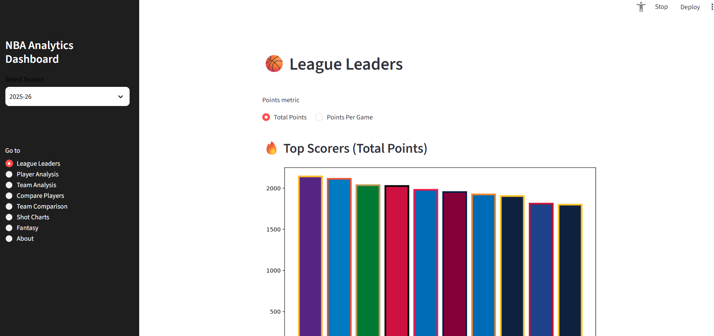
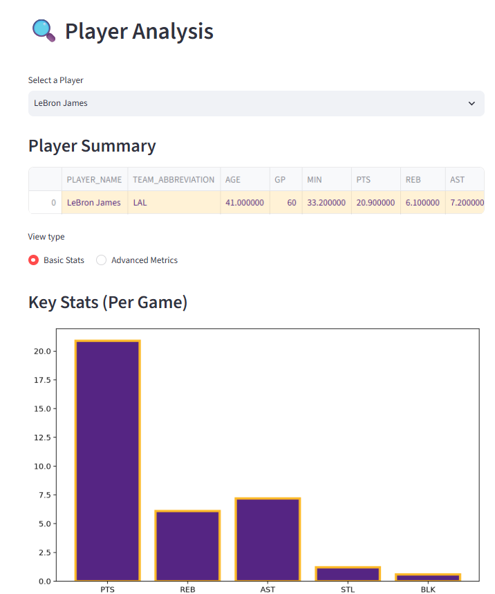
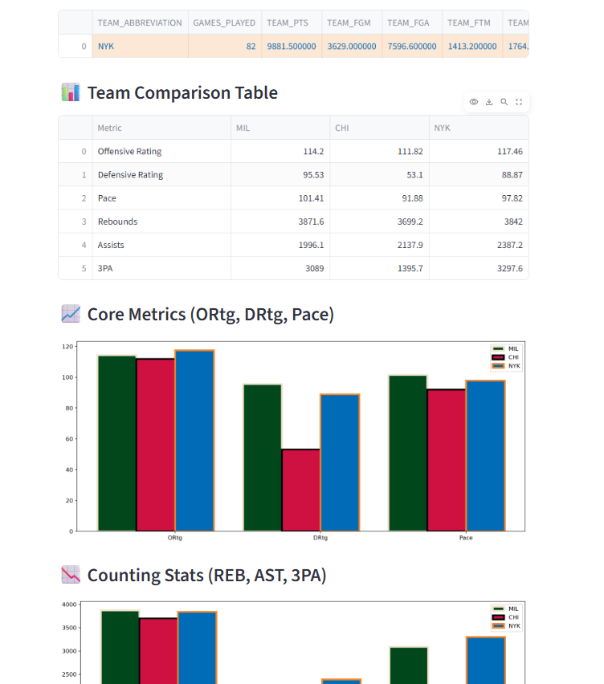
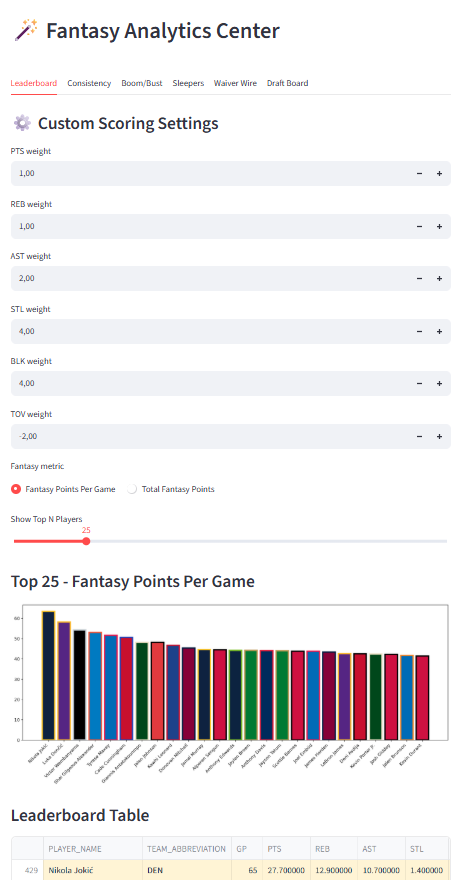
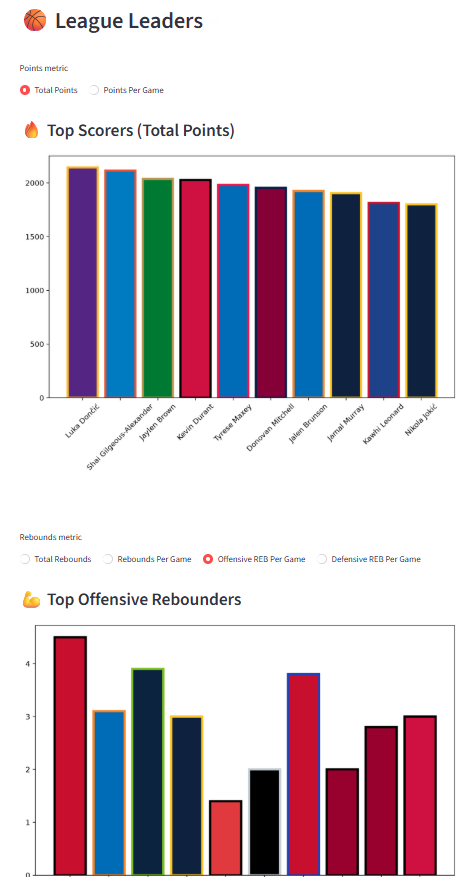

<p align="center">
  
</p>

<h1 align="center">🏀 NBA Analytics Dashboard</h1>

<p align="center">
  A modular NBA analytics platform built with <strong>Python</strong>, <strong>SQLite</strong>, and <strong>Streamlit</strong> that transforms raw NBA data into interactive visualizations, advanced analytics, and fantasy basketball insights.
</p>

<p align="center">


</p>

<p align="center">
  <a href="#overview">📌 Overview</a> •
  <a href="#tech-stack">🛠️ Tech Stack</a> •
  <a href="#screenshots">📸 Screenshots</a> •
  <a href="#features">⭐ Features</a> •
  <a href="#what-i-learned">📚 What I Learned</a> •
  <a href="#project-architecture">🏗️ Architecture</a> •
  <a href="#data-pipeline">🔄 Data Pipeline</a> •
  <a href="#installation">🚀 Installation</a> •
  <a href="#roadmap">🗺️ Roadmap</a> •
  <a href="#author">👨‍💻 Author</a>
</p>

---

<a id="overview"></a>

## 📌 Overview

NBA Analytics Dashboard is an end-to-end basketball analytics application that collects, organizes, and visualizes NBA statistics across multiple seasons.

The project combines official NBA data, advanced basketball metrics, and interactive dashboards into a single platform for exploring player performance, team analytics, fantasy basketball insights, and historical trends.

Designed with a modular architecture, the application separates the data pipeline, analytics engine, visualization layer, and user interface to create a scalable project that is easy to extend with new features.

### Current Highlights

- 📊 Interactive Streamlit dashboard
- 🏀 Player and team analytics
- 📈 Advanced metrics (TS%, eFG%, AST/TOV, Pace, ORtg, DRtg)
- 📅 Multi-season database support
- 🎯 Local shot chart visualizations
- 🎮 Fantasy basketball analytics center
- 🗄️ SQLite-powered backend
- 🔄 Automated data pipeline
- 🚧 Machine learning player projections (currently in development)

## 📖 Professional Overview

NBA Analytics Dashboard is a full-stack data analytics application that transforms raw NBA statistics into an interactive platform for exploring player performance, team trends, advanced analytics, and fantasy basketball insights.

The project was built to strengthen my software engineering and data science skills by recreating the workflow of a real analytics application—from collecting data through APIs to cleaning, storing, analyzing, and visualizing it in a user-friendly interface.

Rather than focusing on a single analysis, the dashboard provides a complete analytics ecosystem where users can:

- 📊 Explore player and team statistics across multiple NBA seasons
- 📈 Analyze advanced basketball metrics and efficiency ratings
- 🎯 Compare players and teams through interactive visualizations
- 🏆 View league leaders across dozens of statistical categories
- 🎮 Evaluate fantasy basketball performance and rankings
- 💾 Query a centralized SQLite database built from official NBA data

The project follows a modular architecture that separates data collection, database management, business logic, and the user interface, making it scalable and easy to extend with future features.

As the project continues to evolve, new capabilities—including machine learning player projections, expanded historical datasets, and additional analytics tools—are being actively developed.

## 🛠️ Tech Stack

### Programming Languages


---

### Data Science & Analytics


---

### Visualization


---

### Database


---

### Data Sources


---

### Development Tools


---

### Currently Learning


## 📸 Screenshots

A quick tour of the NBA Analytics Dashboard.

### 🏠 Dashboard Overview


The landing page provides an interactive overview of league statistics with quick access to player analysis, team comparisons, fantasy basketball tools, and historical NBA data.

---

### 👤 Player Analysis



Explore detailed player profiles featuring traditional statistics, advanced metrics, efficiency ratings, and interactive visualizations across multiple NBA seasons.

---

### 🏀 Team Comparison



Compare any two NBA teams using offensive and defensive metrics, shooting efficiency, rebounding, pace, and advanced analytics.

---

### 🎮 Fantasy Basketball



Analyze fantasy rankings, category strengths, and player value using advanced basketball statistics designed for fantasy basketball enthusiasts.

---

### 🏆 League Leaders



Browse league leaders across dozens of statistical categories with sortable tables and season filters.

---

### ⚙️ Data Pipeline

```text
┌─────────────────┐
│     NBA API     │
└────────┬────────┘
         │
         ▼
┌─────────────────┐
│    CSV Files    │
└────────┬────────┘
         │
         ▼
┌─────────────────┐
│ SQLite Database │
└────────┬────────┘
         │
         ▼
┌─────────────────┐
│ Data Processing │
└────────┬────────┘
         │
         ▼
┌─────────────────┐
│    Streamlit    │
│    Dashboard    │
└─────────────────┘
```

The dashboard automatically retrieves NBA statistics, processes the data, stores it in a SQLite database, and presents the results through an interactive Streamlit interface.

## 📚 What I Learned

Building this project has been one of the most valuable learning experiences of my undergraduate career. Rather than focusing on a single concept, it challenged me to design and develop a complete analytics application from data collection to visualization.

Throughout development, I strengthened my skills in several key areas:

### 🏗️ Software Architecture

- Designed a modular Python project with clearly separated components for data collection, database management, analytics, and visualization.
- Learned how thoughtful project organization improves scalability and maintainability as features are added.

---

### 📊 Data Engineering

- Built automated pipelines to collect and organize NBA statistics from multiple data sources.
- Worked with large datasets using Pandas for cleaning, transformation, and feature engineering.
- Designed and maintained a SQLite database to support fast and reliable querying across multiple NBA seasons.

---

### 📈 Data Visualization

- Created interactive dashboards using Streamlit and Plotly to transform complex datasets into intuitive visualizations.
- Learned how to design interfaces that make statistical information easier to explore and understand.

---

### 💻 Software Development

- Improved my experience using Git and GitHub throughout the development process.
- Learned how to organize a growing codebase while continuously adding new features without sacrificing readability.
- Practiced writing reusable functions and modular components that can be extended over time.

---

### 🏀 Sports Analytics

- Developed a deeper understanding of advanced NBA statistics such as True Shooting Percentage (TS%), Effective Field Goal Percentage (eFG%), Pace, Offensive Rating (ORtg), Defensive Rating (DRtg), and fantasy basketball metrics.
- Gained experience applying statistical concepts to answer real-world analytical questions.

---

### 🚀 Continuous Learning

One of the biggest lessons from this project has been realizing that software development is an iterative process.

The dashboard continues to evolve as I learn new technologies and techniques. My current focus is expanding the project with machine learning models for player performance projections, allowing me to apply predictive analytics to the foundation I've already built.

This project has reinforced not only my technical skills, but also my ability to break large goals into manageable milestones and continuously improve a real-world software application over time.

## 🏗️ Project Architecture

The NBA Analytics Dashboard is organized into modular components that separate the user interface, analytics engine, data pipeline, and storage layer. This structure keeps the project maintainable while making it easy to add new dashboard pages, analytics modules, and datasets.

```text
pabs-nba-analytics-dashboard/
│
├── app.py                         # Streamlit application entry point
│
├── dashboard/
│   ├── components/                # Shared UI styling and reusable components
│   └── pages/                     # Interactive dashboard pages
│       ├── League Leaders
│       ├── Player Analysis
│       ├── Team Analysis
│       ├── Player Comparison
│       ├── Team Comparison
│       ├── Shot Charts
│       ├── Fantasy Analytics
│       └── About
│
├── src/
│   ├── db.py                      # SQLite connection & query helpers
│   ├── metrics.py                 # Advanced basketball metrics
│   ├── team_stats.py              # Team efficiency calculations
│   ├── utils.py                   # Shared utilities
│   ├── colors.py                  # NBA team branding
│   │
│   ├── fantasy/                   # Fantasy analytics engine
│   │   ├── Scoring
│   │   ├── Consistency
│   │   ├── Boom/Bust Analysis
│   │   ├── Sleepers
│   │   ├── Waiver Wire
│   │   ├── Draft Rankings
│   │   └── Game Log Collection
│   │
│   └── shot_charts/               # Shot chart visualization engine
│       ├── Data Collection
│       ├── Court Rendering
│       ├── Scatter Charts
│       ├── Heatmaps
│       ├── Hexbin Charts
│       ├── Filtering
│       └── Data Processing
│
├── src/data_pipeline/
│   ├── Database Creation
│   ├── Season Loading
│   └── Basketball Reference Normalization
│
├── data/
│   ├── Raw NBA Data
│   ├── Processed Data
│   ├── Shot Chart Dataset (2010–Present)
│   └── Player Game Logs (2010–Present)
│
├── notebooks/                     # Exploratory analysis
├── reports/                       # Generated reports and charts
├── images/                        # README screenshots
│
├── requirements.txt
└── README.md
```

---

## 🧩 Architecture Overview

The project is divided into four primary layers:

| Layer | Responsibility |
|--------|----------------|
| **Presentation** | Streamlit dashboard pages, reusable UI components, and interactive visualizations. |
| **Analytics** | Advanced basketball metrics, fantasy basketball models, shot chart generation, and statistical calculations. |
| **Data Pipeline** | Imports, cleans, and normalizes data from the NBA API and Basketball Reference before loading it into SQLite. |
| **Storage** | Organized datasets and a centralized SQLite database powering the dashboard. |

---

## 🎯 Design Philosophy

This project was intentionally built using a modular architecture rather than a single-file Streamlit application.

The goals were to:

- Separate business logic from the user interface.
- Keep analytics modules reusable across multiple pages.
- Make adding new dashboard features straightforward.
- Support multiple NBA seasons without changing the application structure.
- Create a codebase that remains maintainable as the project continues to grow.

As the dashboard has expanded, this architecture has made it possible to introduce entirely new modules—such as Fantasy Analytics and Shot Charts—without requiring major changes to the existing application.

## 🔄 Data Pipeline

The NBA Analytics Dashboard is powered by an automated data pipeline that collects, processes, and stores NBA statistics before presenting them through an interactive Streamlit dashboard.

The pipeline is designed to separate data ingestion from visualization, making it easy to update datasets, add new NBA seasons, and extend the application with additional analytics.

```text
                    NBA API
                       │
                       ▼
            Basketball Statistics
                       │
                       ▼
              Raw CSV Generation
                       │
                       ▼
      Basketball Reference Normalization
                       │
                       ▼
            Data Cleaning & Validation
                       │
                       ▼
             SQLite Database Creation
                       │
                       ▼
         Advanced Metrics Calculation
                       │
                       ▼
       Dashboard Query & Visualization
                       │
                       ▼
           Interactive Streamlit App
```

---

## 📥 1. Data Collection

NBA statistics are collected from two primary sources:

| Source | Purpose |
|--------|---------|
| **NBA API** | Current and historical player, team, and game statistics |
| **Basketball Reference** | Historical datasets and supplementary statistics |

The raw datasets are stored within the project's `data/` directory before undergoing preprocessing.

---

## 🧹 2. Data Processing

Before being loaded into the database, the raw datasets are cleaned and standardized.

Processing includes:

- Standardizing player and team names
- Normalizing Basketball Reference datasets
- Removing duplicate records
- Handling missing values
- Formatting statistics for consistent database storage

These preprocessing steps ensure data remains consistent across every supported NBA season.

---

## 🗄️ 3. Database Generation

Once cleaned, the datasets are loaded into a centralized SQLite database.

The database serves as the primary data source for every dashboard page and provides fast querying for:

- Player statistics
- Team statistics
- League leaders
- Fantasy basketball analytics
- Shot chart data

Using SQLite allows the dashboard to remain lightweight while supporting complex analytical queries.

---

## 📊 4. Analytics Layer

The analytics engine builds upon the database by calculating advanced basketball metrics that are not directly available from the raw data.

Examples include:

- True Shooting Percentage (TS%)
- Effective Field Goal Percentage (eFG%)
- Assist-to-Turnover Ratio
- Pace
- Offensive Rating (ORtg)
- Defensive Rating (DRtg)
- Fantasy basketball scoring and rankings

These calculations power multiple dashboard pages and visualizations.

---

## 🖥️ 5. Visualization Layer

The processed data is presented through an interactive Streamlit interface where users can:

- Explore league leaders
- Analyze individual players
- Compare players and teams
- Visualize shot charts
- Evaluate fantasy basketball performance
- Browse multiple NBA seasons

Because every page reads from the same centralized database, new features can be added without rebuilding the underlying data pipeline.

---

## 🚀 Future Improvements

The data pipeline was designed with future expansion in mind.

Planned enhancements include:

- Machine learning player projections
- Automated season updates
- Additional historical datasets
- Expanded fantasy basketball models
- Performance optimization for larger datasets

# 🚀 Installation

Follow the steps below to set up and run the NBA Analytics Dashboard locally.

## 1️⃣ Clone the Repository

```bash
git clone https://github.com/Pab200/pabs-nba-analytics-dashboard.git
cd pabs-nba-analytics-dashboard
```

---

## 2️⃣ Create a Virtual Environment

### Windows

```bash
python -m venv .venv
.venv\Scripts\activate
```

### macOS / Linux

```bash
python3 -m venv .venv
source .venv/bin/activate
```

---

## 3️⃣ Install Dependencies

```bash
pip install -r requirements.txt
```

---

## 4️⃣ Launch the Dashboard

```bash
streamlit run app.py
```

Once launched, Streamlit will automatically open the dashboard in your default web browser.

---

# 🛠️ Data Pipeline

The project includes utilities for building and maintaining the SQLite database used by the dashboard.

## Build the Database

Create the database from the raw datasets:

```bash
python src/data_pipeline/create_database.py
```

---

## Load a New NBA Season

1. Place the new season CSV files into:

```text
data/raw/
```

Required files:

```text
season_stats_YYYY-YY.csv
team_game_stats_YYYY-YY.csv
```

Then execute:

```bash
python src/data_pipeline/data_loader.py
```

---

## Normalize Basketball Reference Data

Convert Basketball Reference datasets into the same schema used throughout the dashboard:

```bash
python src/data_pipeline/normalize_br.py
```

This allows Basketball Reference data to integrate seamlessly with data collected from the NBA API.

---

## Project Workflow

```text
Clone Repository
        │
        ▼
Create Virtual Environment
        │
        ▼
Install Dependencies
        │
        ▼
Run Dashboard
        │
        ▼
(Optional) Update Database
```

# 🗺️ Project Roadmap

The NBA Analytics Dashboard is an active project that continues to evolve as I explore new areas of data science, software engineering, and basketball analytics.

## ✅ Completed

- Interactive Streamlit dashboard
- Multi-season NBA database
- League leaders and statistical rankings
- Player analysis
- Team analysis
- Player comparison
- Team comparison
- Advanced basketball metrics (TS%, eFG%, ORtg, DRtg, Pace, etc.)
- Fantasy Basketball Analytics Center
- Interactive shot charts
- SQLite data pipeline
- Historical data integration
- Modular project architecture

---

## 🚧 Currently In Development

### 🤖 Machine Learning Player Projections

Predict future player performance using historical NBA statistics.

**Current Progress**

- ✅ Historical training dataset created
- ✅ Feature engineering
- 🚧 Regression model development
- ⏳ Model evaluation
- ⏳ Dashboard integration

---

## 🔮 Future Features

### 🏆 Fantasy Basketball

- Draft assistant
- Trade analyzer
- Rest-of-season rankings
- Weekly matchup predictor

### 📊 Analytics

- Player similarity search
- Career trajectory visualizations
- Interactive statistical trends
- Team chemistry analysis

### 🎯 Shot Charts

- Player comparison overlays
- Zone efficiency analysis
- Team shot profile comparisons
- Playoff shot chart support

### 🧠 Artificial Intelligence

- Player projections
- Breakout player prediction
- Award prediction models
- Team win projections

### ⚡ Performance

- Faster database queries
- Caching improvements
- Automatic season updates
- Improved loading times

---

## 🌟 Long-Term Vision

The long-term goal is to transform this project from an NBA statistics dashboard into a complete basketball analytics platform that combines:

- Interactive data visualization
- Advanced statistical analysis
- Fantasy basketball tools
- Predictive machine learning models
- Historical NBA data exploration

Ultimately, I hope to continue expanding the project as I learn new technologies throughout my Data Science and Computer Science degree.

# 👨‍💻 Author

## Pablo Miller-Niharra

**Data Science & Computer Science Student**  
University of Wisconsin–Madison

I'm passionate about combining **software engineering**, **data science**, and **machine learning** to build applications that transform data into meaningful insights.

The NBA Analytics Dashboard is one of my largest personal projects and serves as a platform for continuously learning new technologies, improving my software engineering skills, and exploring modern sports analytics.

---

### 📫 Connect With Me

- **GitHub:** https://github.com/Pab200
- **LinkedIn:** https://www.linkedin.com/in/pablo-miller-niharra/
- **Email:** pablomillerniharra@gmail.com

---

### ⭐ If You Enjoyed This Project

If you found this project interesting or helpful, consider giving the repository a ⭐ on GitHub!

Feedback, suggestions, and contributions are always welcome.
